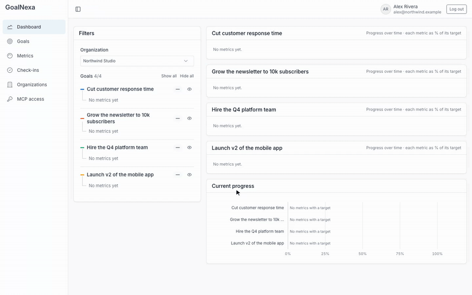
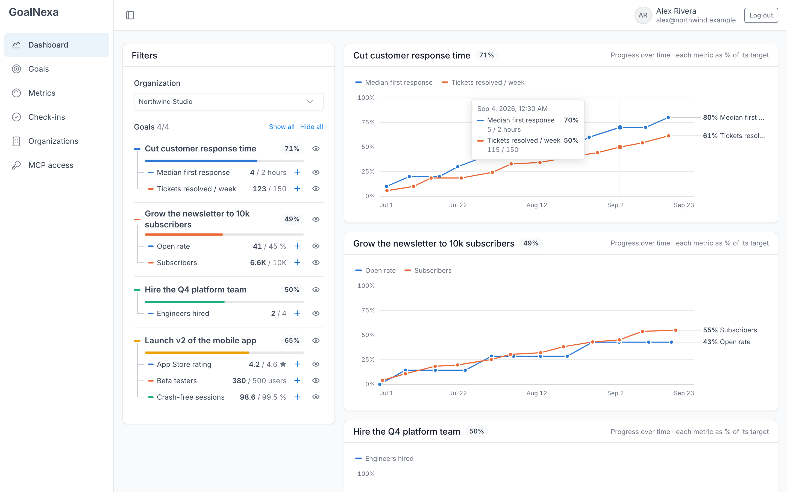
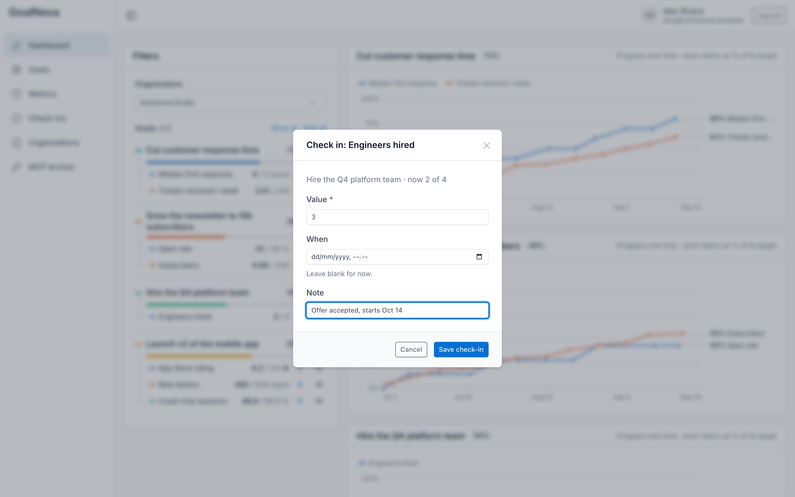
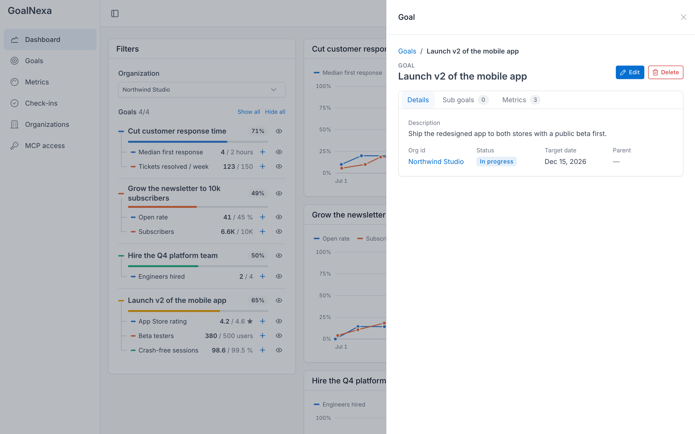
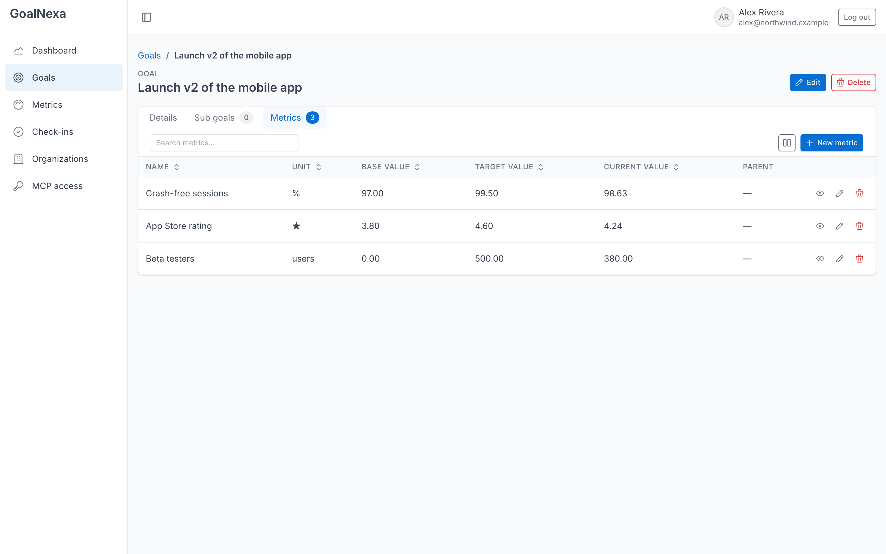
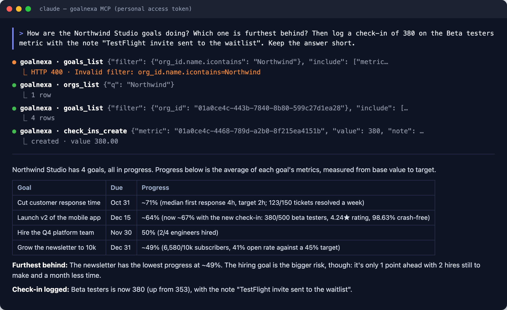
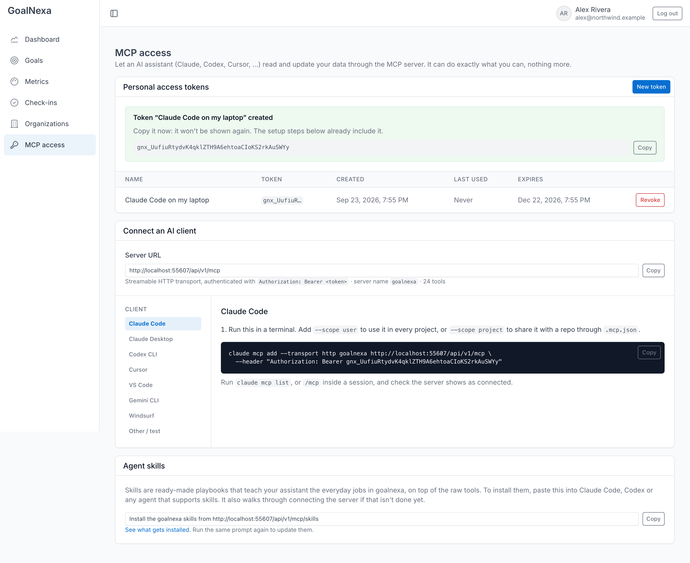
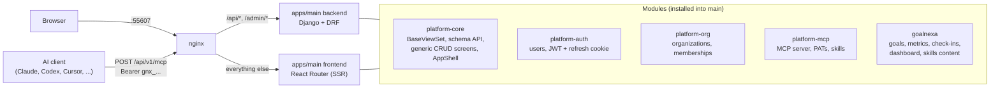

# GoalNexa

**Goals, metrics and check-ins on your own server, with AI assistants built in.**

GoalNexa is a self-hosted goal tracker for people and teams. Set a goal, break
it into numbers you can measure, check in as they move, and watch every metric
trend toward its target. Or let Claude, Codex or Cursor do the check-ins and the
weekly review for you.



<sub>Also as [MP4](docs/media/walkthrough.mp4). All data shown is demo data from [`scripts/seed_demo.py`](scripts/seed_demo.py).</sub>

<sub>**Source-available** under the [PolyForm Shield License 1.0.0](LICENSE): free to use, modify and self-host for any purpose, including inside your company, except offering it as a competing product or service. [Details](#license).</sub>

---

## Why GoalNexa

**Your goals, your server.** One `docker compose up` and it runs on your
machine, your NAS or your VPS. No vendor account, no telemetry, and no
per-seat pricing that grows with your team.

**Progress you can actually see.** Every goal breaks down into metrics with a
start, a target and a unit: 0 → 500 beta testers, 12 → 2 hours response time,
10 → 40 km a week. The dashboard charts each metric's journey side by side, so
you spot the one that's stalling before it's too late.

**Honest about direction.** A metric can go *down* on purpose (response times,
costs, weight), and progress is still measured correctly. Forgot to log on
Friday? Backdate the check-in; the current value always follows the latest
reading.

**Personal and team, in one place.** Keep your half-marathon plan private and
your team's OKRs in a shared organization, then switch between them with one
dropdown.

**An AI teammate, on your terms.** A built-in [MCP](https://modelcontextprotocol.io)
server lets any modern AI assistant read and update your goals. Claude connects
by signing in, other clients with a personal access token, and you can
disconnect either at any time. It can do exactly what you
can and nothing more.

<table>
  <tr>
    <td width="50%"><br><sub><b>Every metric, over time.</b> Hover to see each reading as a % and as the real number.</sub></td>
    <td width="50%"><br><sub><b>Check in from anywhere on the dashboard.</b> Value, optional time and a note.</sub></td>
  </tr>
  <tr>
    <td width="50%"><br><sub><b>Details without losing your place.</b> Open any goal or metric in a side drawer.</sub></td>
    <td width="50%"><br><sub><b>Everything is connected.</b> A goal's metrics, a metric's check-ins, sub-goals and organizations, all linked.</sub></td>
  </tr>
</table>

## Talk to your goals

Connect Claude (desktop app, claude.ai, mobile) as a custom connector: in
Claude, **Settings → Connectors → Add custom connector**, paste
`https://<your-host>/api/v1/mcp`, click **Connect** and allow access. No token
needed. Claude Code, Codex, Cursor, VS Code, Gemini CLI and Windsurf take about
a minute too: create a token on the **MCP access** page, copy the snippet for
your client, and ask away:



<sub>A real, unedited Claude Code run against the demo data. The first call used a bad filter; the server answered with a clear error and Claude corrected itself.</sub>

### Teach your assistant the job, with one prompt

GoalNexa ships **agent skills**: playbooks that teach your assistant the everyday
work, beyond raw data access.

| Skill | Say something like | What it does |
|---|---|---|
| `goalnexa-check-in` | "ran 12 km today", "we're at 420 beta testers" | Finds the right metric, works out totals versus increments and backdating, logs it and reports the new progress |
| `goalnexa-review` | "weekly review", "what's behind?" | Progress and pace against each target date, at-risk goals, stale metrics and three concrete next steps |
| `goalnexa-plan` | "I want to run a half marathon in November" | Drafts a goal with 1–4 measurable metrics, confirms them with you, then creates them |

Install them all by pasting **one line** into your assistant (it's also on the
MCP access page, with your server's address filled in):

```text
Install the goalnexa skills from https://<your-goalnexa-host>/api/v1/mcp/skills
```

Your assistant reads the instructions your GoalNexa instance serves at that
address: it connects the MCP server if needed (asking you for a token), saves
each skill where your client looks for skills, and tells you what it installed.
Run the same line again to update them.



## Get started

```sh
git clone --recurse-submodules https://github.com/PMNexa/GoalNexa.git
cd GoalNexa
docker compose up --build
```

Open **http://localhost:55607** and sign up. To look around with the demo data
from the screenshots:

```sh
python3 scripts/seed_demo.py        # then log in as alex@northwind.example / CorrectHorse!Battery9
```

---

# Technical overview

## Architecture

GoalNexa is a **host app plus pluggable modules**. `apps/main` is the running
application (Django + DRF backend, React Router v8 frontend). Each module ships
**both halves as packages**: a pip-installable Django app and an npm package of
screens plus a route builder. `main` installs them and owns every URL. Nothing
is copied between modules.



| Path | What | Repo |
|---|---|---|
| `apps/main/` | The host app: settings, URL mounts, routes, app shell, nav | this repo |
| `apps/goalnexa/` | Goal / Metric / CheckIn, dashboard, the agent skills' content | this repo |
| `apps/platform-core/` | DRF kernel: `BaseViewSet`/`BaseSerializer` (filtering, sorting, sideloading, schema API), error contract, schema-driven CRUD screens, design system | [PMNexa/platform-core](https://github.com/PMNexa/platform-core) |
| `apps/platform-auth/` | Users, login/signup, rotating refresh tokens, session store | [PMNexa/platform-auth](https://github.com/PMNexa/platform-auth) |
| `apps/platform-org/` | Multi-tenant organizations and memberships | [PMNexa/platform-org](https://github.com/PMNexa/platform-org) |
| `apps/platform-mcp/` | MCP server over every `BaseViewSet`, OAuth and personal access tokens, agent-skills serving, the MCP access page | [PMNexa/platform-mcp](https://github.com/PMNexa/platform-mcp) |
| `nginx/default.conf` | Single-port gateway: `/api/*` and `/admin/*` go to the backend, everything else to the frontend | this repo |
| `scripts/seed_demo.py` | Demo data through the REST API | this repo |
| `docs/product-discovery/` | Market research behind the product | this repo |

**Generic CRUD, schema-driven.** A resource is a model plus a `BaseViewSet`.
From that alone it gets a REST API (`?filter{field.lookup}=`, `?sort=`, `?q=`,
`?include[]=` sideloading, a paginated envelope), a `schema` endpoint, and list,
create, detail and edit screens with to-many relations as tabs. It also gets
MCP tools. Registering it in the frontend is one line:
`...createCrudRoutes("/api/v1/<resource>")`.

**Progress math** (`apps/goalnexa/frontend/src/lib/progress.ts`): metric progress
is `(current − base) / (target − base)`, so metrics that should go down work
too, and a goal's progress is the mean of its metrics'. `Metric.current_value`
is the value of the latest check-in by `checked_in_at` (user-set, backdatable)
and is recomputed on every check-in change.

### MCP server, OAuth and personal access tokens

- `POST /api/v1/mcp` speaks MCP's Streamable HTTP transport (stateless, JSON
  responses). Every `BaseViewSet` resource gets
  `<resource>_schema/_list/_get/_create/_update/_delete` tools, plus
  `_link/_unlink` for many-to-many relations. That's 24 tools today, with
  nothing written per resource.
- Each tool call is an **internal sub-request to the real REST endpoint**, run
  as the caller. Scoping, validation and error shapes are the API's own, and a
  bad call comes back as a tool error the model can recover from.
- **Personal access tokens** (`gnx_` + 40 random characters, stored only as a
  SHA-256 hash, optional expiry, last-used tracking) work **only at the MCP
  endpoint**. They're rejected by the rest of the API and can't create or revoke
  other tokens. Manage them at `/mcp` or through `GET/POST/DELETE /api/v1/mcp/tokens`.
- **OAuth 2.1** for clients that sign in instead (Claude's custom connectors):
  discovery through `/.well-known/oauth-protected-resource` and
  `/.well-known/oauth-authorization-server`, dynamic client registration, PKCE,
  a consent page at `/mcp/authorize`, 1-hour access tokens with rotating refresh
  tokens. Their access tokens work only at the MCP endpoint too. Connected apps
  are listed at `/mcp`, where they can be disconnected.

### Agent skills

- Any installed Django app can ship skills as
  `<app>/mcp_skills/<skill-name>/SKILL.md` (the Agent Skills format). goalnexa's
  are in `apps/goalnexa/backend/goalnexa/mcp_skills/`.
- platform-mcp finds them automatically and serves them publicly:
  - `GET /api/v1/mcp/skills` is the index, and doubles as the install prompt: a
    step-by-step procedure the agent follows.
  - `GET /api/v1/mcp/skills/<name>/<file>` serves each file.
- Every file is rendered with the instance's own URLs (`{{mcp_url}}`,
  `{{tokens_url}}`, ...). Set `MCP_PUBLIC_URL` when the instance sits behind a
  proxy that changes the host or scheme.

Details: [`apps/platform-mcp/README.md`](apps/platform-mcp/README.md) (client
setup) and its `AGENTS.md` (mechanics).

## Development

Everything runs in Docker with live reload. `./apps` is mounted into the
containers, so edits to any module show up immediately.

```sh
git submodule update --init          # if you cloned without --recurse-submodules
docker compose up --build            # http://localhost:55607
docker compose logs -f main-backend  # or main-frontend
```

Running `apps/main` without Docker:

```sh
cd apps/main/backend
python -m venv .venv && . .venv/bin/activate
pip install -r requirements.txt -e ../../platform-core/backend -e ../../platform-auth/backend \
  -e ../../platform-org/backend -e ../../goalnexa/backend -e ../../platform-mcp/backend
python manage.py migrate && python manage.py runserver

cd apps/main/frontend && npm install && npm run dev
```

The frontend depends on each module's package through local `file:` paths, so
the sibling `apps/*` directories (the submodules) must be checked out.

**Tests**

| Module | Command |
|---|---|
| platform-core backend | `cd apps/platform-core/backend && python manage.py test tests --settings=config.test_settings` |
| platform-core frontend | `cd apps/platform-core/frontend && npx vitest run` |
| platform-mcp backend | `cd apps/platform-mcp/backend && python manage.py test tests --settings=config.test_settings` |
| main frontend types | `cd apps/main/frontend && npm run typecheck` |

**Adding a module** (a new resource, a new screen, a new Django app): see
[`AGENTS.md`](AGENTS.md), the source of truth for conventions and the gotchas
already hit. Each module has its own `AGENTS.md` too.

## License

GoalNexa is **source-available** under the [PolyForm Shield License 1.0.0](LICENSE).
You may use, modify and share it for any purpose, including inside your
company, **except** providing a product or service that competes with it or
with the licensor's products. That means no hosting it as a paid service and
no selling it or a modified copy of it. For uses the license doesn't allow,
ask about a commercial license. Contributions are accepted under the
[Contributor License Agreement](CONTRIBUTING.md#contributor-license-agreement).
